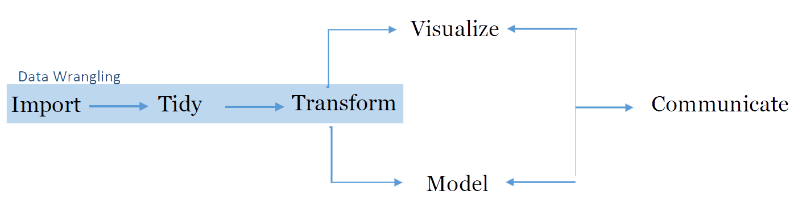

---
title       : Introduction to R
subtitle    : The Data Analysis Workflow 
author      : Adam J Sullivan
job         : 
license     : by-nc-nd
framework   : io2012        # {io2012, html5slides, shower, dzslides, ...}
highlighter : highlight.js  # {highlight.js, prettify, highlight}
hitheme     : tomorrow      # 
widgets     : [mathjax, quiz, bootstrap, interactive]            # {mathjax, quiz, bootstrap}
mode        : selfcontained # {standalone, draft}
logo        : shield_image.png
biglogo     : shield_image_large.png
knit        : slidify::knit2slides
assets      : {assets: ../../assets}
---  .segue bg:grey

# Workflow Basics

--- .class #id

## The Data Analysis Workflow

- Concept from Hadley Wickham
- R works extremely well for this. 

---  .segue bg:grey

# Data Wrangling

--- .class #id

## Data Wrangling

- This is the first step for any work in data analysis. 
- We must first get our data, possibly from multiple sources. 
- We then take it from the original format into one that is useful for us. 
- Finally we clean the data. 

--- .class #id

## Importing Data

<h3> Ways to Get Data into R </h3>
- .csv, .txt. .xls, ....
- SPSS, SAS, Stata
- Web Scraping

--- .class #id

## Importing Data

<h3> Ways to Get Data into R </h3>
- Databases
    - MySQL
    - Oracle
    - PostgreSQL
    - MongoDB

--- .class #id

## Tidying Data

<h3> Ways to Tidy Data</h3>
- `tidyr` package
- Handles many data structures
- Natural Language Processing

--- .class #id

## Transforming Data

<h3> Working with Data </h3>
- R has multiple tools to manipulate and transform data.
- It can index multiple data types.
- It handles missing data extremely well. 

---  .segue bg:grey

# Data Exploration and Analysis

--- .class #id

## Data Exploration and Analysis

- R has many tools available to do all aspects of exploration and analysis. 
- R has over 10000 packages and the number is growing exponentially.

--- .class #id

## Visualizing Data

<h3> Ways to Visualize Data.  </h3>
- R has an easy to use base graphics package.
- It is easy to manipulate and change a graph in anyway. 
- `ggplot2` is an extensive Graphics package and language for graphics. 

--- .class #id

## Modeling Data

<h3> Ways to Model Data </h3>
- With over 10,000 packages, it is hard to find a method that R does not have a function for. 
- It handles all traditional models like linear, logistic, log-linear, ...
- It can handle many advanced methods and algorithms. 

--- .class #id

## Transforming Data

<h3> Transforming Data Again? </h3>
- When visualizing and transforming data it is often needed to transform data again. 
- R easily creates and manipulates variables. 

--- .class #id

## Transforming Data

<h3> Transforming Data Again? </h3>
- When visualizing and transforming data it is often needed to transform data again. 
- R easily creates and manipulates variables. 

---  .segue bg:grey

# Data Collaboration and Publishing

--- .class #id

##  Data Collaboration and Publishing

- Data Collaboration and publishing are key to all fields. 
- `RStudio` provides many tools for this. 

--- .class #id

##  Data Communication

- `RStudio` connects easily to:
    - [Github](https://www.github.com/)
    - [RPubs](https://rpubs.com/)
    - [RStudio Connect](https://www.rstudio.com/products/connect/)

--- .class #id

##  Data Visualization

- `shiny` provides an interactive data visualization and java script environment.
- `plotly` allows for interactive graphics for webpages. 
- `RStudio` can make webpages, books, slides, and many other documents that can help relay data. 

