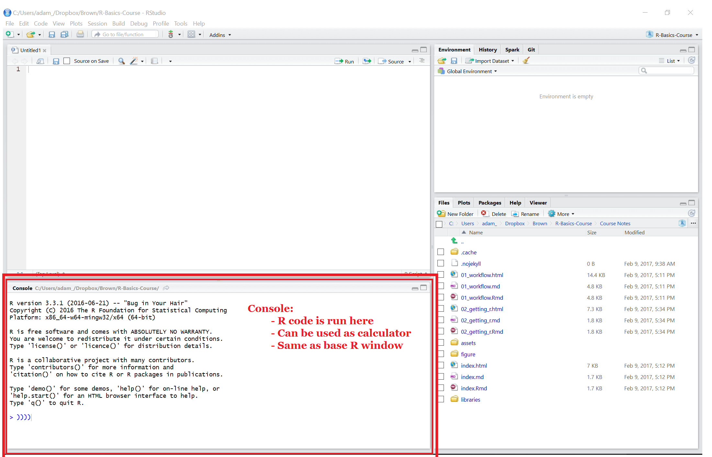

---
title       : Introduction to R
subtitle    : Your First R Session! 
author      : Adam J Sullivan
job         : 
license     : by-nc-nd
framework   : io2012        # {io2012, html5slides, shower, dzslides, ...}
highlighter : highlight.js  # {highlight.js, prettify, highlight}
hitheme     : tomorrow      # 
widgets     : [mathjax, quiz, bootstrap, interactive]            # {mathjax, quiz, bootstrap}
mode        : selfcontained # {standalone, draft}
logo        : shield_image.png
biglogo     : shield_image_large.png
knit        : slidify::knit2slides
assets      : {assets: ../../assets}
---  .segue bg:grey

# Ways to Use R

--- .class #id

## Base R

--- .class #id

## RStudio

--- .class #id

## RStudio

--- .class #id
 
## RStudio

--- .class #id
 
## RStudio

--- .class #id
 
## RStudio

